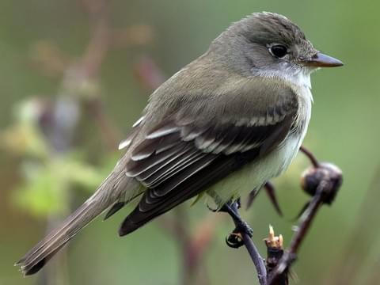
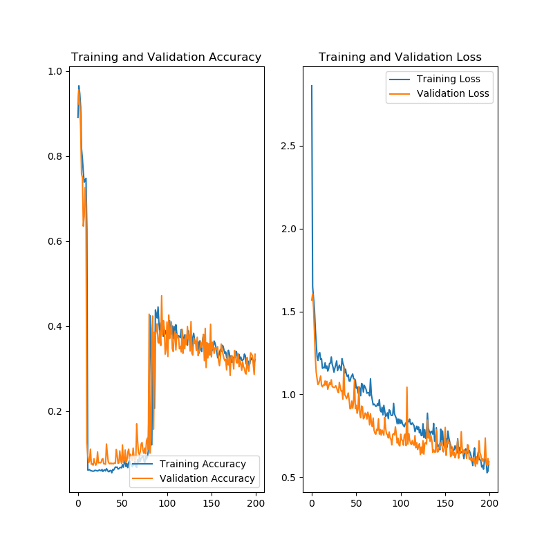
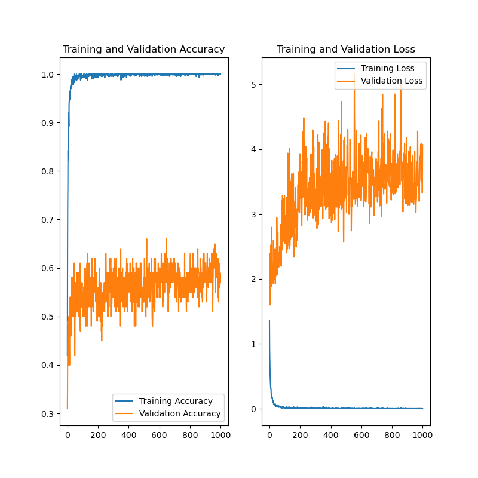
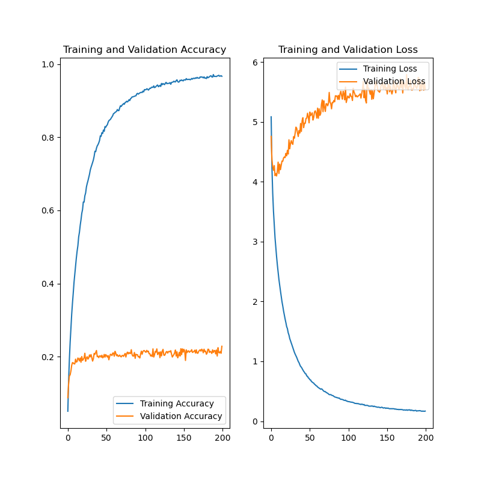

# Bird Call ID

## Objective
My objective for this project is to be able to predict the species of a bird given their call.  This is a problem faced by real world scientists who would like to be able to identify a bird wihtout even seeing them physically.  This has lots of practical applications for not just birds in North America but bird species around the world.  

## Data
My data is was provided by kaggle and is a huge data set of over 20,000 audio files with 264 bird species.  Each bird species has a range of 30 - 100 different audio files to make predicitons on.  Each bird species is not necessarily recorded in the same location all of the time.  And there are various recording devices used for each recording, which maakes the background noise vary greatly.  
 
Link to audio files if you would like to listen to some of them:[Link](https://www.kaggle.com/imoore/xenocanto-bird-recordings-dataset) 

## Method to the Madness
- Change each audio file into a spectrogram so that all of the audio is encompassed in a single image
- Use a CNN to train on the spectrograms and make predicitons
- Start of simple with only 5 classes and see how well my model is performing
- Once I am satisfied, move onto the full 264 classes

## Initial Model
My initial neural network was a simple CNN with only around 4 million paramaters to train on, which for a simple neural network is not a tiny amount but certainly is not the largest there could be.  This model was a constant struggle to get to see the patterns that are in these images.  In the ned after days of tinkering and training the model I was only able to get it to a measly 32% accuracy, and in this case random guessing is a 20% accuracy, so my model is not doing well at picking up the patterns in my bird calls.

    

 
Obviously this is not a great model and so I wanted to improve upon it.

## Transfer Learning
In an attempt to improve my model I employed the technique of transfer learning to improve my results.  I chose to do this instead of trying to continue my current model because theres only so much I can do with my simple neural network.  The transfer learning models available from Tensorflow are extremely powerful and pretrained for much longer than I ever could with my model making them perfect for this problem.  The transfer model I chose to use is the Inception-ResNet V2 using the pretrained imagenet weights.  Using this model proved to be extremely successful!  Using this technique I was able to get my training accuracy to 99.99% and my validation accuracy to 60% which is a massive improvment!  Below is is an example of what the model looks like trained to 1000 epochs which is excessive, but I wanted to see where all of my accuracies and losses were moving to and whether they were still improving or not.

    

 
This is not bad for trainging on five classes.  It is time to move onto the full 264 classes.

## Full dataset
Below are my results after 200 epochs of training on AWS for the full 264 classes.  Random guessing in this case is 1/264 or .038% accuracy.  My neural network is overfitting to the training data a bit, which is a consequence of using such a powerful and large neural network.  I will be continuing to imrpove the model to the best it can get to.
 

    

